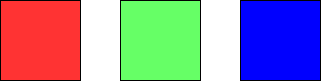

# Painting a Grid With Three Different Colors

## INFO

**Index**: 1931

**Level**: Hard

**Link**: [Daily Question 2025-05-18](https://leetcode.com/problems/domino-and-tromino-tiling/description/?envType=daily-question&envId=2025-05-18)

---

## DESCRIPTION

You are given two integers `m` and `n` grid where each cell is initially white. You can paint each cell **red**, **green** or **blue**. All cells **must** be painted.

Return the number of ways to color the grid with **no two adjacent cells having the same color**. Since the answer can be very large, return it **modulo** $10^9 + 7$

## EXAMPLE

### Example 1:

    

    
    Input: m = 1, n = 1
    Output: 3
    Explanation: The three possible colorings are shown in the image above.

### Example 2:

    

    Input: m = 1, n = 2
    Output: 6
    Explanation: The six possible colorings are shown in the image above.

### Example 3:

    Input: m = 5, n = 5
    Output: 580986

---

## CONTRAINTS

- `1 <= m <= 5`
- `1 <= n <= 1000`
