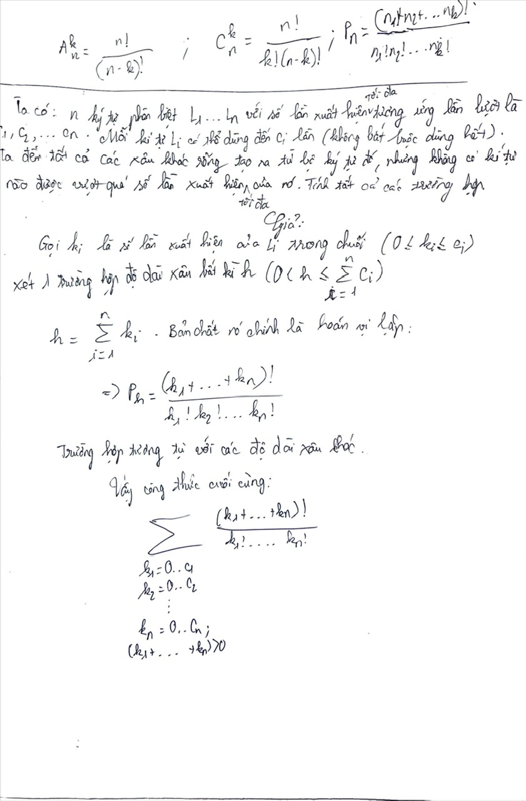

# Math Form Conversion From Problem
We are given an initial string consisting of distinct characters (L1, L2, L3 ..., Ln) with corresponding frequencies (c1, c2, c3, ..., cn). The objective is to count the number of non-empty strings that can be formed using these characters, where each character can be used at most as many times as it appears in the initial string.

## Solution

$$
\sum_{\substack{0 \leq k_i \leq c_i \\ \sum k_i \neq 0}} 
\frac{\left(\sum k_i \right)!}{k_1! \, k_2! \, \dots \, k_n!}
$$

## Detail

